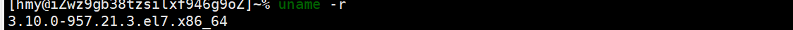
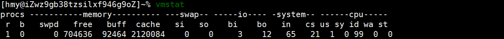
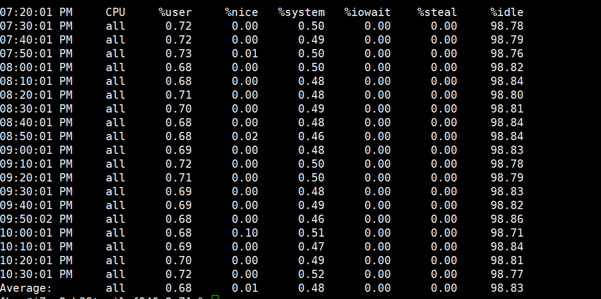

Linux环境与版本

1.uname -r 

显示系统的版本

2.vmstat

>procs：进程相关统计,如r(运行队列进程数)、b(等待IO进程数)等。
>
>**r 列表示运行和等待cpu时间片的进程数，如果长期大于1，说明cpu不足，需要增加cpu。**
>
>**b 列表示在等待资源的进程数，比如正在等待I/O、或者内存交换等。**
>**memory：**
>
>**swpd 切换到内存交换区的内存数量(k表示)。如果swpd的值不为0，或者比较大，比如超过了100m，只要si、so的值长期为0，系统性能还是正常**
>
>**free 当前的空闲页面列表中内存数量(k表示)**
>
>**buff 作为buffer cache的内存数量，一般对块设备的读写才需要缓冲。**
>
>**cache: 作为page cache的内存数量，一般作为文件系统的cache，如果cache较大，说明用到cache的文件较多，如果此时IO中bi比较小，说明文件系统效率比较好。**
>**swap：**
>
>**si 由内存进入内存交换区数量**
>
>**so由内存交换区进入内存数量。**
>
>
>**IO：**
>
>**bi 从块设备读入数据的总量（读磁盘）（每秒kb）**
>
>**bo 块设备写入数据的总量（写磁盘）（每秒kb）**
>
>**这里我们设置的bi+bo参考值为1000，如果超过1000，而且wa值较大应该考虑均衡磁盘负载，可以结合iostat输出来分析。**
>**system 显示采集间隔内发生的中断数：**
>
>**in 列表示在某一时间间隔中观测到的每秒设备中断数。**
>
>**cs列表示每秒产生的上下文切换次数，如当 cs 比磁盘 I/O 和网络信息包速率高得多，都应进行进一步调查。**
>
>**cpu 表示cpu的使用状态：**
>
>**us 列显示了用户方式下所花费 CPU 时间的百分比。us的值比较高时，说明用户进程消耗的cpu时间多，但是如果长期大于50%，需要考虑优化用户的程序。**
>
>**sy 列显示了内核进程所花费的cpu时间的百分比。这里us + sy的参考值为80%，如果us+sy 大于 80%说明可能存在CPU不足。**
>
>**id 列显示了cpu处在空闲状态的时间百分比**
>
>**wa 列显示了IO等待所占用的CPU时间的百分比。这里wa的参考值为30%，如果wa超过30%，说明IO等待严重，这可能是磁盘大量随机访问造成的，也可能磁盘或者磁盘访问控制器的带宽瓶颈造成的(主要是块操作)。**

3.sar

>- %user：用于表示用户模式下消耗的 CPU 时间的比例；
>- %nice：通过 nice 改变了进程调度优先级的进程，在用户模式下消耗的 CPU 时间的比例；
>- %system：系统模式下消耗的 CPU 时间的比例；
>- %iowait：CPU 等待磁盘 I/O 导致空闲状态消耗的时间比例；
>- %steal：利用 Xen 等操作系统虚拟化技术，等待其它虚拟 CPU 计算占用的时间比例；
>- %idle：CPU 空闲时间比例。

linux 2.6.* 内核默认支持的文件系统有哪些?

>ext2 ext3 ext4 xfs

